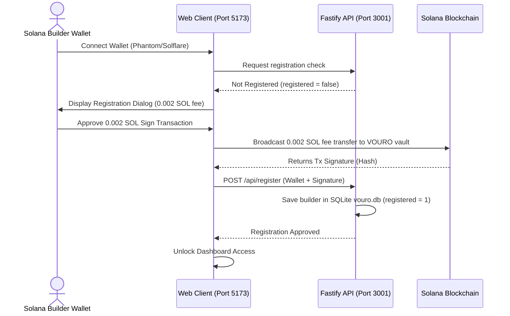

# VOURO System Documentation & API Reference

Welcome to the official developer and system documentation for **VOURO**—a decentralized, Solana-based Proof-to-Earn (P2E) platform featuring an interactive voxel world, high-performance client diagnostics, and multi-layered verification mechanisms.

This document serves as a complete reference guide for the backend, frontend, database schemas, and integration architectures of the VOURO codebase.

---

## 1. System Architecture Overview

VOURO is structured as a monorepo containing multiple apps and modular packages, built to ensure loose coupling, high testability, and strict boundary controls.

```mermaid
graph TD
    Client[web: React + Three.js/R3F + Tailwind] <-->|HTTP / WS| API[api: Fastify Server]
    API <-->|better-sqlite3| DB[(SQLite Database: vouro.db)]
    API <-->|RPC Requests| Helius[Solana & Helius RPC]
    API <-->|API Calls| Price[Jupiter Price API & DexScreener]
    
    subgraph Packages
        Shared[@vouro/shared - Core Interfaces]
        Validation[@vouro/validation - Zod Schemas]
        Providers[@vouro/data-providers - External APIs]
    end
    
    API -.-> Packages
    Client -.-> Packages
```

### Monorepo Layout
- **`apps/web`**: React application featuring the interactive Three.js voxel viewport, state management with Zustand, real-time charts (Recharts), and responsive user panels.
- **`apps/api`**: Fastify server that serves data, handles proofs validation, manages database states, and coordinates real-time broadcasts.
- **`packages/shared`**: Typings, core entities, and constant values shared across the client and the server.
- **`packages/validation`**: Centralized Zod verification schemas for request payloads.
- **`packages/data-providers`**: Concrete clients for Helius RPC, Solana Ledger, Jupiter Pricing v3, DexScreener API, and GitHub OAuth verification.

---

## 2. SQLite Database Schema

VOURO uses `better-sqlite3` for local persistence, utilizing a structured relational model representing registration states, bounties, and transactions.

### Entity Diagrams & Definitions

#### `builders`
Stores registration, reputation scores, badges, and completed metrics of developer wallets.
```sql
CREATE TABLE IF NOT EXISTS builders (
  wallet TEXT PRIMARY KEY,           -- Solana Public Key address
  vouchScore INTEGER,                -- Builder reputation score (0-100)
  rank INTEGER,                      -- Global leaderboard rank
  completedMissions INTEGER,         -- Count of approved proof cubes
  approvalRate REAL,                 -- Percentage of approved proofs
  totalRewardEarned REAL,            -- Cumulative tokens claimed
  activeStreak INTEGER,              -- Consecutive successful submissions
  specializations TEXT,              -- JSON array of specialties (e.g. ["solana", "github"])
  badges TEXT,                       -- JSON array of earned achievements
  tier TEXT,                         -- Reputation tier (Rising, Proven, Apex)
  joinedAt TEXT,                     -- ISO timestamp of registration
  totalSubmissions INTEGER,          -- Total submissions made
  rejectedSubmissions INTEGER,       -- Total rejected submissions
  disputesOpened INTEGER,            -- Count of filed disputes
  disputesLost INTEGER,              -- Count of failed disputes
  avgResponseTimeHours REAL,         -- Mean response time
  monthlyHistory TEXT,               -- JSON array of monthly performance metrics
  categoryBreakdown TEXT,            -- JSON array of category-specific achievements
  recentMissions TEXT,               -- JSON array of recent approved activities
  registered INTEGER DEFAULT 0,      -- Wallet registration status (0/1)
  regTxSignature TEXT                -- 0.002 SOL fee transaction signature
);
```

#### `districts`
Represents geographic sectors of the Voxel viewport.
```sql
CREATE TABLE IF NOT EXISTS districts (
  id TEXT PRIMARY KEY,               -- District unique ID
  name TEXT,                         -- District name
  creator TEXT,                      -- Founding wallet address
  trustScore INTEGER,                -- District trust index (0-100)
  activeMissions INTEGER,            -- Active mission nodes inside district
  rewardLocked REAL,                 -- Total token value locked in vault
  builders INTEGER,                  -- Participating builder count
  verificationMethod TEXT,           -- SLA validation method description
  status TEXT,                       -- Active / Degraded / Maintenance
  description TEXT                   -- Sector narrative description
);
```

#### `missions`
Campaign instances loaded onto the platform by sponsors.
```sql
CREATE TABLE IF NOT EXISTS missions (
  id TEXT PRIMARY KEY,               -- Mission unique ID
  title TEXT,                        -- Mission name
  description TEXT,                  -- Technical guidelines and scope
  districtId TEXT,                   -- Parent district foreign key
  districtName TEXT,                 -- Cached district name
  creator TEXT,                      -- Creator wallet address
  rewardAmount REAL,                 -- Reward payout size
  rewardToken TEXT,                  -- Mint name (SOL / USDC / VOURO)
  usdEstimate REAL,                  -- Calculated USD value of the bounty
  slots INTEGER,                     -- Total available worker slots
  acceptedCount INTEGER,             -- Accepted slots count
  deadline TEXT,                     -- ISO timestamp of campaign expiration
  proofType TEXT,                    -- Proof validation type ("solana", "github", "url")
  verificationRules TEXT,            -- Detailed validation constraints
  revisionLimit INTEGER,             -- Max allowed submission revisions
  disputePeriod INTEGER,             -- SLA window in hours for filing disputes
  requiredVouchScore INTEGER,        -- Reputation entry threshold
  requiredBadges TEXT,               -- JSON array of required badges
  txSignature TEXT,                  -- Vault funding escrow transaction hash
  status TEXT,                       -- active / expiring / verifying / completed / disputed
  createdAt TEXT                     -- ISO timestamp of campaign creation
);
```

#### `submissions`
Proof Cube instances uploaded by builders for campaigns.
```sql
CREATE TABLE IF NOT EXISTS submissions (
  id TEXT PRIMARY KEY,               -- Submission unique ID
  missionId TEXT,                    -- Associated mission ID
  missionTitle TEXT,                 -- Cached mission title
  builderWallet TEXT,                -- Submitting developer wallet
  status TEXT,                       -- pending / approved / rejected / disputed
  proofHash TEXT,                    -- SHA-256 hash of the proof payload (antiduplication)
  proofType TEXT,                    -- github / solana / url
  content TEXT,                      -- JSON string of proof metadata
  reasons TEXT,                      -- JSON array of verification issues
  rejectionCode TEXT,                -- PR_INCOMPLETE / WRONG_SIGNER / DUPLICATE_PROOF
  rejectionReason TEXT,              -- Detailed reason text for rejection
  reviewerWallet TEXT,               -- Validating admin wallet address
  timestamp TEXT,                    -- ISO timestamp of submission
  revisionIndex INTEGER              -- Revision index (0-indexed)
);
```

#### `disputes`
SLA dispute escalations.
```sql
CREATE TABLE IF NOT EXISTS disputes (
  id TEXT PRIMARY KEY,
  submissionId TEXT,
  missionId TEXT,
  openedBy TEXT,
  reason TEXT,
  status TEXT,                       -- open / resolved
  createdAt TEXT,
  resolvedAt TEXT,
  resolution TEXT,
  resolvedBy TEXT
);
```

#### `events`
Platform audit log and real-time feed events.
```sql
CREATE TABLE IF NOT EXISTS events (
  id TEXT PRIMARY KEY,
  timestamp TEXT,
  type TEXT,                         -- mission_created / mission_accepted / submission_created / reward_claimed / etc.
  wallet TEXT,
  missionId TEXT,
  missionTitle TEXT,
  signature TEXT,
  dataSource TEXT,                   -- solana / database / github
  confirmationStatus TEXT,           -- processed / confirmed / finalized
  details TEXT
);
```

---

## 3. REST API Reference

The backend operates on a JSON REST interface using Fastify. Validation is strictly enforced at the routing tier using Zod schemas from `@vouro/validation`.

### Endpoint Directory

| Method | Route | Description | Auth / Payload Validation |
|:---|:---|:---|:---|
| **GET** | `/api/health` | Retrieves system health and RPC connection latency | None |
| **GET** | `/api/world` | Returns global VOURO aggregate stats | None |
| **GET** | `/api/world/events` | Retrieves real-time feeds (Solana & local DB) | None |
| **GET** | `/api/districts` | Retrieves list of all districts | None |
| **GET** | `/api/districts/:id` | Returns single district data with associated missions | None |
| **GET** | `/api/missions` | Retrieves list of all campaigns | None |
| **GET** | `/api/missions/:id` | Returns single campaign details | None |
| **POST**| `/api/missions` | Creates a new mission node | `createMissionSchema` |
| **POST**| `/api/missions/:id/fund` | Verifies and completes vault funding | On-Chain transaction signature |
| **POST**| `/api/missions/:id/accept` | Registers builder as worker on a mission | Reputation & Vouch Score verification |
| **POST**| `/api/missions/:id/submit` | Uploads a new proof cube | `submitProofSchema` + SHA-256 check |
| **GET** | `/api/submissions` | Lists all submissions | None |
| **GET** | `/api/submissions/:id` | Returns single submission details | None |
| **POST**| `/api/submissions/:id/review`| Approves/rejects a pending submission | `reviewProofSchema` |
| **POST**| `/api/submissions/:id/revise`| Submits updated files for a rejected proof | Revision limit verification |
| **POST**| `/api/submissions/:id/dispute`| Opens a dispute escalation | `disputeSchema` + 48h limit check |
| **POST**| `/api/rewards/:id/claim` | Requests SPL rewards transfer release | Double-claim protection |
| **GET** | `/api/builders/:wallet` | Returns builder stats profile | None |
| **POST**| `/api/register` | Registers wallet with 0.002 SOL fee | Verify register signature (db check) |
| **GET** | `/api/builders/:wallet/activity`| Returns activity feed for a specific builder | None |
| **GET** | `/api/prices` | Resolves current Jupiter pricing for list of mints | Cache validation (20s TTL) |
| **GET** | `/api/market/token/:mint` | Fetches pairs and volume from DexScreener | None |
| **POST**| `/api/proofs/github/validate` | Authenticates GitHub commit / PR | `githubValidateSchema` |
| **POST**| `/api/proofs/solana/validate` | Verifies Solana Transaction proof | `solanaValidateSchema` |
| **POST**| `/api/webhooks/helius` | Processes real-time Helius transaction webhooks | Webhook Authorization header |

---

### Key Endpoint Payload Specifications

#### 1. Launch Campaign (`POST /api/missions`)
**Request Body:**
```json
{
  "title": "Optimize R3F Voxel mesh culling",
  "description": "Optimize voxel drawing inside R3F scenes...",
  "districtId": "dist-1-proof-frontier",
  "rewardAmount": 15.5,
  "rewardToken": "SOL",
  "slots": 1,
  "deadline": "2026-07-24T00:00:00.000Z",
  "proofType": "github",
  "verificationRules": "Submit GitHub PR linked to vouro-monorepo...",
  "revisionLimit": 2,
  "disputePeriod": 48,
  "requiredVouchScore": 40,
  "requiredBadges": [],
  "txSignature": "4V8x9y0z1a...",
  "creator": "5W34n2k12pD14vS..."
}
```

#### 2. Submit Proof Cube (`POST /api/missions/:id/submit`)
**Request Body:**
```json
{
  "builderWallet": "9zP7w333...",
  "proofType": "github",
  "content": {
    "repository": "vouro-frontier/vouro-monorepo",
    "pullRequestNumber": 12
  }
}
```

#### 3. Review Proof Cube (`POST /api/submissions/:id/review`)
**Request Body:**
```json
{
  "status": "approved", // approved or rejected
  "reviewerWallet": "5W34n2k1...",
  "rejectionCode": "PR_INCOMPLETE", // required if status = rejected
  "rejectionReason": "Work is missing culling modules" // required if status = rejected
}
```

#### 4. Register Builder (`POST /api/register`)
**Request Body:**
```json
{
  "wallet": "GqK5z111111...",
  "signature": "3zP2vFpH7..."
}
```

---

## 4. WebSocket Broadcast Protocol

VOURO runs a WebSocket endpoint to notify connected clients instantly of ledger changes, voxel status updates, and user achievements.

### Connection Endpoint
```
ws://localhost:3001/ws
```

### Event Payload Formats

Every broadcast event follows a structured schema:
```json
{
  "id": "evt-7h3b9r",
  "timestamp": "2026-06-24T13:58:31.000Z",
  "type": "mission_created",
  "wallet": "5W34n2k12pD14vSgQrtA71F6JzE8g9sK7qX9wY2z1t",
  "missionId": "mission-83b2",
  "missionTitle": "Jupiter Pricing V3 Cache Endpoint Implementation",
  "signature": "2KV9nKK5a...",
  "dataSource": "solana",
  "confirmationStatus": "finalized",
  "details": "Mission funded with 7,500 USDC locked in Vault."
}
```

#### Supported Event Types (`type`)
1. `mission_created`: Broadcasted when a sponsor registers and funds a new mission.
2. `mission_funded`: Fired when Solana logs confirm escrow activation.
3. `mission_accepted`: Broadcasted when a builder registers/accepts a task.
4. `submission_created`: Sent when a builder uploads a new proof cube.
5. `proof_approved`: Broadcasted when a reviewer validates a submission.
6. `proof_rejected`: Fired when a reviewer rejects a proof cube.
7. `dispute_opened`: Broadcasted when a builder disputes a rejection.
8. `reward_claimed`: Triggered when rewards are released from the Vault.

---

## 5. Developer Guide & Tutorial

This walkthrough details setting up, running, and simulating a complete end-to-end user lifecycle on VOURO.

### Prerequisites & Setup

1. **Environment Variables (`apps/api/.env`)**:
   ```env
   PORT=3001
   HELIUS_RPC_URL=https://api.mainnet-beta.solana.com
   HELIUS_API_KEY=your_key_here
   HELIUS_WEBHOOK_SECRET=your_webhook_secret_here
   JUPITER_API_KEY=your_jupiter_key_here
   GITHUB_CLIENT_SECRET=your_github_client_secret_here
   ```

2. **Run Workspace in Development**:
   ```bash
   pnpm install
   pnpm dev
   ```

---

### Step-by-Step User Lifecycle Simulation



#### Step 1: Connect Wallet & Pay Registration Fee
1. Open the VOURO Client at `http://localhost:5173`.
2. Click **Connect Wallet** in the top right.
3. A connection prompt will appear. In production, this uses Solana wallet adapters (Phantom, Solflare, etc.). For development simulation, the application prompts with a simulated connection.
4. **Registration Validation**: The app queries `GET /api/builders/:wallet`. If the database returns `registered = false`, you must sign the registration transaction.
5. **The Fee**: A transaction message prompts the user to confirm a **0.002 SOL registration fee**.
6. Once the fee signature is generated, the client sends a `POST /api/register` request containing the signature. The server records this in SQLite and sets `registered = true`.

#### Step 2: Accept a Mission
1. Go to the **Missions Map** or **Campaign Directory** tab.
2. Select a mission, e.g. *Optimize Voxel mesh rendering inside R3F scene*.
3. Click **Accept Bounty**.
4. The system validates if your wallet meets the `requiredVouchScore` (e.g. Vouch Score must be $\ge 20$).
5. Upon verification, the backend increments `acceptedCount` and saves the updated state in SQLite. The mission is now visible in your **My Active Bounties** tab.

#### Step 3: Submitting Proof
1. Complete the code changes or deployment.
2. Go to the **Proof Submission Lab** or click **Submit Proof** directly on your active bounty card.
3. Provide the required proof:
   - For **GitHub Proofs**: Provide repository and PR number.
   - For **Solana Proofs**: Provide the on-chain transaction signature.
4. The client issues a `POST /api/missions/:id/submit` request. The backend hashes the contents using SHA-256 and checks for duplicates. If unique, it saves the proof with a status of `pending`.

#### Step 4: Verification Queue & Review
1. Access the **Verification Queue** (simulated admin or peer validator role).
2. Pending submissions are displayed showing proof types and verification parameters.
3. Reviewers can choose to:
   - **Approve**: Changes status to `approved`, increases builder's completed count, awards reputation points, and locks in vault release permissions.
   - **Reject**: Changes status to `rejected`, reactivates the mission slot, and requires specifying a `rejectionCode` (e.g. `PR_INCOMPLETE`) and detailed feedback.

#### Step 5: Disputes (Optional)
1. If rejected, builders can inspect their submission under **Disputes**.
2. Within **48 hours** of rejection, the builder can fill in a Dispute claim form and submit a `POST /api/submissions/:id/dispute` request.
3. The mission status changes to `disputed`, locking vault assets until resolved.

#### Step 6: Claiming Rewards
1. Once approved, the claim is listed under **Rewards Vault**.
2. Click **Claim Reward SPL** on the reward card.
3. The client calls `POST /api/rewards/:id/claim`.
4. The server runs double-claim protection. If valid, the server logs a `reward_claimed` event, updates the vault ledger, and releases the tokens.

---

## 6. GPU Performance Engine & Client Diagnostics

To ensure a smooth rendering experience inside the 3D Voxel world, VOURO features a built-in Client Diagnostic Engine that monitors frame rendering performance and GPU strain in real-time.

```
+--------------------------------------------------------+
| [!] GPU STALL DETECTED (High GPU Latency > 16.6ms)     |
| Current Frame Rate: 42 FPS | GPU Latency: 23.8ms       |
|                                                        |
| Recommendations:                                       |
| - Close high-GPU applications in the background        |
| - Lower voxel render distance                          |
| - Enable R3F Level of Detail (LOD)                     |
+--------------------------------------------------------+
```

### Diagnostic Mechanism
- **Frame Timings**: The engine monitors rendering loop intervals. If consecutive frames drop below 60 FPS (exceeding **16.67ms** per frame), it registers a performance dip.
- **GPU Heavy Stall Notification**: If frame latency stays above **33ms** (less than 30 FPS) for over 3 seconds, a premium, warning banner is displayed.
- **Optimization Suggestions**: The dialog suggests specific actions, including turning off background applications, switching to a different web browser, or adjusting quality/culling variables.

---

## 7. Solana RPC and Helius Webhook Integrations

### On-Chain Activity Feeds
Rather than relying solely on local databases, the VOURO backend queries real Solana ledger activity:
1. When `/api/world/events` is requested, the server fetches the 8 most recent transactions on the Solana system program (or Helius endpoint).
2. It parses transaction signers, timestamps, and signatures.
3. It maps these signatures into the world event stream dynamically, creating a feed of real-world activity.

### Helius Webhooks
For real-time on-chain confirmation:
- Helius calls `POST /api/webhooks/helius` on transaction finalization.
- The server processes transfers to the vault public keys asynchronously.
- The webhook processing pipeline is idempotent, verifying transaction signature states prior to modification.
